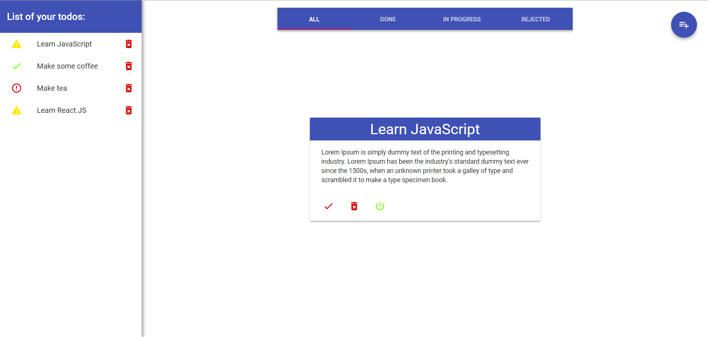

## Todo-list app based on React.JS/Node.JS/MongoDB

### For starting app you should do the next:

1.  yarn / npm i
2.  yarn run build / npm run build
3.  yarn run start-prod / npm run start-prod
4.  go to http://localhost:8080/

